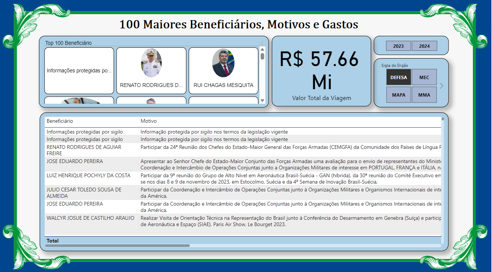
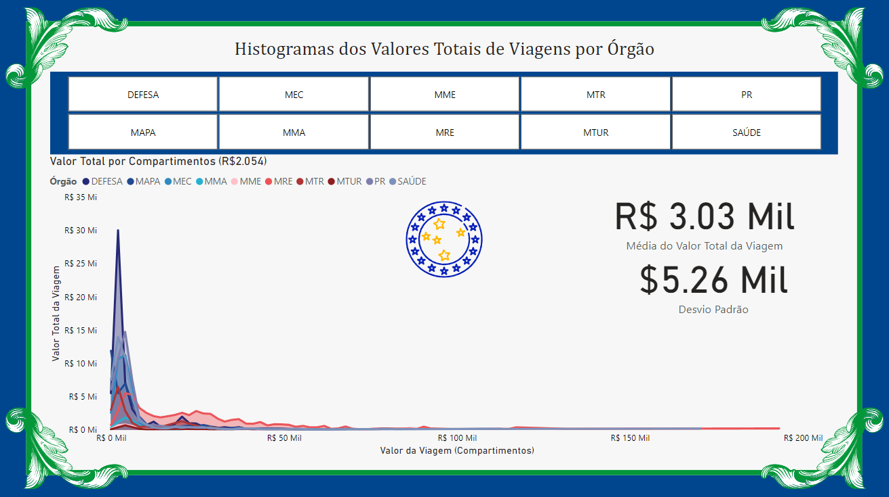
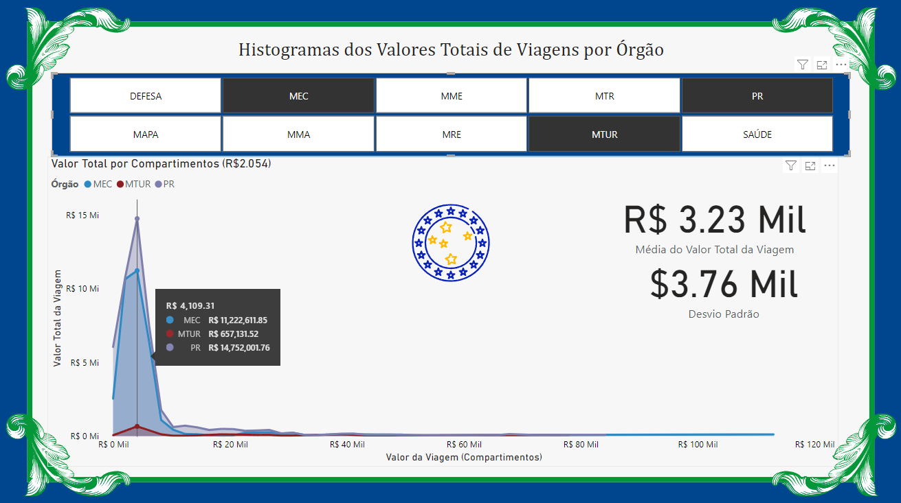

# Dados de Viagens do Governo Brasileiro

Este projeto utiliza a API do [Portal da Transparência](https://portaldatransparencia.gov.br) para consultar dados de viagens de funcionários do governo brasileiro e inserir os registros em um banco PostgreSQL.

Os dados usados no relatório Power BI correspondem a viagens coletadas entre 01/01/2023 e 30/04/2024 para órgãos selecionados por código SIAFI.

## Estrutura do projeto

```text
viagens_gov_br/
├── src/
│   ├── config.py
│   ├── api_client.py
│   ├── database.py
│   ├── schema.sql
│   └── ingest.py
├── scripts/
│   └── run_ingestion.py
├── .env.example
├── requirements.txt
└── README.md
```

## Requisitos

- Python 3.10+
- PostgreSQL
- Chave de API do Portal da Transparência

Instale as dependências:

```bash
pip install -r requirements.txt
```

## Configuração

Crie um arquivo `.env` na raiz do projeto usando `.env.example` como referência:

```env
API_KEY=
DB_NAME=
DB_USER=
DB_PASSWORD=
DB_HOST=localhost
DB_PORT=5432
API_TIMEOUT_SECONDS=30
API_MAX_RETRIES=3
API_BACKOFF_SECONDS=2
API_PAGE_DELAY_SECONDS=1
```

O arquivo `.env` não deve ser versionado, pois contém credenciais.

As variáveis `API_TIMEOUT_SECONDS`, `API_MAX_RETRIES`, `API_BACKOFF_SECONDS` e `API_PAGE_DELAY_SECONDS` controlam timeout, tentativas, backoff e pausa entre páginas para respeitar limites temporários da API.

## Execução da ingestão

Execute:

```bash
python -m src.ingest --data-inicio 2023-01-01 --data-fim 2023-01-31 --orgao 20000
```

As datas devem ser informadas no formato `YYYY-MM-DD`. O comando converte os valores para o formato usado pela API (`DD/MM/YYYY`), usa o mesmo período para ida e retorno e divide períodos longos em janelas mensais.

Para consultar vários órgãos no mesmo período, use códigos SIAFI separados por vírgula:

```bash
python -m src.ingest --data-inicio 2024-05-01 --data-fim 2026-04-30 --orgaos 20000,22000,26000
```

Para limitar a quantidade de registros processados em uma execução, use:

```bash
python -m src.ingest --data-inicio 2023-01-01 --data-fim 2023-01-31 --orgao 20000 --max-requests 1000
```

A API de viagens trabalha com intervalos de datas limitados. Para coletas longas, rode a ingestão por janelas menores e ajuste os parâmetros entre execuções.

## Dados importantes

Para coletar os dados é necessário informar o código do Sistema Integrado de Administração Financeira (SIAFI), que identifica o órgão consultado.

Códigos usados no projeto:

- `20000` - Presidência da República
- `22000` - Ministério da Agricultura e Pecuária
- `26000` - Ministério da Educação
- `32000` - Ministério de Minas e Energia
- `35000` - Ministério das Relações Exteriores
- `36000` - Ministério da Saúde
- `39000` - Ministério dos Transportes
- `44000` - Ministério do Meio Ambiente
- `52000` - Ministério da Defesa
- `54000` - Ministério do Turismo

Alguns códigos consultados podem não estar disponíveis na API.

## Relatório Power BI

O arquivo `relatorio_viagens.pbix` contém o relatório com análises de gastos de viagens. As imagens abaixo mostram as principais páginas.

### Tela de início


### Top 10 Beneficiários


### Top 100 Beneficiários




### Histograma




## Referências

- [Portal da Transparência](https://portaldatransparencia.gov.br)
- [API de Dados do Portal da Transparência](https://portaldatransparencia.gov.br/api-de-dados)
- [PostgreSQL](https://www.postgresql.org/)

## App web local

O repositório inclui um dashboard local com FastAPI, React, Plotly e Leaflet:

```text
app/
├── backend/
│   ├── main.py
│   ├── queries.py
│   └── schemas.py
└── frontend/
    └── src/
```

Instale as dependências Python e inicie o backend:

```bash
pip install -r requirements.txt
uvicorn app.backend.main:app --reload --host 127.0.0.1 --port 8000
```

Em outro terminal, inicie o frontend:

```bash
cd app/frontend
npm install
npm run dev
```

Acesse `http://127.0.0.1:5173`.

Também há um `docker-compose.yml` com PostgreSQL, backend e frontend para desenvolvimento local.

## Enriquecimento geográfico

Crie a tabela e índices executando `src/views.sql` no PostgreSQL. O pipeline de geocodificação extrai localidades a partir de textos de motivo e grava cache em `viagem_localidades`.

Antes de usar Nominatim, defina um `NOMINATIM_USER_AGENT` identificável no `.env`. A política pública do Nominatim exige identificação, cache de resultados e no máximo 1 requisição por segundo para o serviço público.

```bash
python -m src.geocode --limit 100 --delay-seconds 1
```
