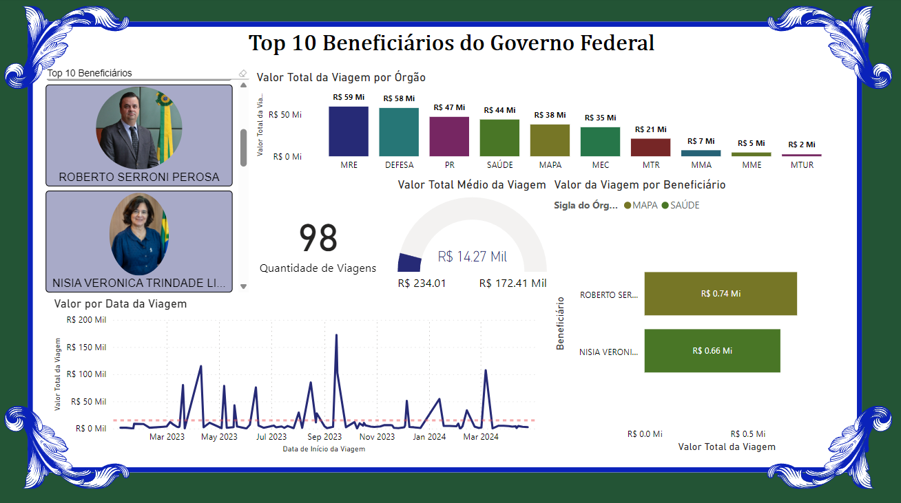

# Dados de viagens do Governo Brasileiro

## Introdução
Este é um projeto que utiliza da API do [Portal da Transparência](https://portaldatransparencia.gov.br) para acessar dados de viagens feitas por funcionários do governo brasileiro e inseri-los em uma base de dados PostgreSQL.
<br />
<br />
Os dados que foram utilizados neste projeto correspondem aos dados de viagens de funcionários do Ministério das Relações Exteriores, Ministério da Saúde, Ministério da Educação e Presidência da República, durante o período de 01/01/2023 até 30/04/2024. Um total de 104.239 dados foram coletados.
<br />
<br />
Para coletar os dados, é necessário o código do Sistema Integrado de Administração Financeira (SIAFI), não foi possível coletar dados de alguns códigos de ministérios, por isso foram selecionados os ministérios mencionados. Os códigos estão descritos na seção de [Dados Importantes](#dados-importantes). Caso queira, você pode procurar outros códigos SIAFI para montar seu banco de dados.  

### Sobre o Portal da Transparência e a API de dados

O Portal da Transparência do Governo Federal é um site destinado a divulgar dados e informações detalhadas sobre a execução orçamentária e financeira da União. 
As informações disponíveis no Portal abrangem o Poder Executivo e a esfera federal. Essa ferramenta também publica dados sobre assuntos relacionados à função da maioria desses órgãos.
<br />
<br />
O Portal da transparência também possuí uma API de dados que pode ser acessada por indivíduos brasileiros que possuem uma conta gov.br com autenticação de dois fatores. Esta autenticação é necessária para receber uma chave da API que deverá ser utilizada para acessar os dados.
Para mais informações sobre a API e como acessar os dados, acesse o site da [API de dados](https://portaldatransparencia.gov.br/api-de-dados).

### Sobre o banco de dados postgreSQL

Os dados recebidos através da API serão inseridos em um banco de dados PostgreSQL. Caso tenha dúvidas sobre o PostgreSQL, acesse o [site](https://www.postgresql.org/about/). Você também pode fazer o download [aqui](https://www.postgresql.org/download/).

<a name="dados-importantes"></a>
## Dados importantes ❗
* Sua chave de API - deve ser requerida no site da API de dados. Cuidado para não compartilhar a sua chave! Ela pode ser protegida utilizando um arquivo .env, que será explicado na seção [Gerando um arquivo .env](#arquivo-env)
### O código do Sistema Integrado de Administração Financeira (SIAFI).
O SIAFI é utilizado para registro da execução orçamentária, financeira, patrimonial e contábil dos órgãos da Administração Pública Direta federal, das autarquias, fundações e empresas públicas federais e das sociedades de economia mista que estiverem contempladas no Orçamento Fiscal e/ou no Orçamento da Seguridade Social da União.
* O código SIAFI é necessário para especificar de qual órgão você está requerindo os dados. Os códigos que foram utilizados para o projeto são:
  *  20000 - Presidência da República
  *  22000 - Ministério da Agricultura e Pecuária
  *  26000 - Ministério da Educação
  *  32000 - Ministério de Minas e Energia
  *  35000 - Ministério das Relações Exteriores
  *  36000 - Ministério da Saúde
  *  39000 - Ministério dos Transportes
  *  44000 - Ministério do Meio Ambiente
  *  52000 - Ministério da Defesa
  *  54000 - Ministério do Turismo
<br />
⚠️ Alguns códigos consultados não estavam disponíveis, por isso foram utilizados estes ministérios.
<br />

<a name="arquivo-env"></a>
## Gerando um arquivo .env
### O que é um arquivo .env?
O arquivo .env é um tipo de arquivo de configuração que guarda variáveis de ambiente. Normalmente, um arquivo .env é um arquivo de texto simples que contém pares de chave-valor, nos quais cada linha representa uma variável de ambiente e seu valor associado.
Os arquivos .env são usados principalmente para configurar e modificar o comportamento de aplicativos em diferentes ambientes (como desenvolvimento, teste e produção) sem a necessidade de alterar o código fonte. As variáveis definidas em um arquivo .env podem ser lidas por aplicativos durante sua inicialização para configurar conexões de banco de dados, chaves de API e senhas, por exemplo.

### Como gerar e configurar um arquivo .env?
Primeiro é necessário instalar a biblioteca [python-dotenv](https://pypi.org/project/python-dotenv/). Você pode fazer isto executando o seguinte comando no terminal:
```
pip install python-dotenv
```
* Após configurar seu banco de dados, será necessário inserir seus dados em um arquivo chamado ".env". Os dados que você precisará são:
    1. Nome do seu banco de dados;
    2. Nome do usuário;
    3. Senha do banco de dados;
    4. Nome do Host;
    5. Número da porta.  
<br />
Crie o arquivo com o nome ".env" e insira os valores da configuração do seu banco de dados, por exemplo:

```
API_KEY=abc123xyz456
DB_NAME=database
DB_USER=usuario
DB_PASSWORD=senha
DB_HOST=localhost
DB_PORT=5432
```
Esta configuração será utilizada no arquivo [requests_viagens.py](requests_viagens.py).

## Relatório Power BI
A seguir você verá algumas images do relatório dos gastos das viagens. Três páginas principais foram feitas, a primeira demonstra os dez principais beneficiários, aqueles que tiveram os maiores valores de viagens, gastos por ministério, número de viagens, gasto médio (com mínimo e máximo) e datas de início do afastamento. A segunda página mostra os cem principais beneficiários, assim como os motivos e justificativa de urgência da viagem. Por fim, uma página com histogramas p=or ministérios, valores médios e desvio padrão.

#### Tela de início
Aqui você pode visualizar o total de viagens, órgão consultados e três botões para seguir para as diferentes páginas.


#### Top 10 Beneficiários
Nesta página você pode visualizar os Top 10 beneficiários (com imagens), quantidade de viagens, média do valor da viagem (com valor mínimo e máximo), total de gastos por órgão e datas do início do afastamento.


Também é possível visualizar a porcetagem de viajens que foram internacionais ou nacionais ao colocar a seta do mouse sobre o órgão.


As mesmas informações aparecem caso selecione somente um dos beneficiários. Para mostrar o tipo de viagem, basta colocar o mouse sobre o valor da viagem do beneficiário no gráfico "Valor da Viagem por Beneficiário".


Por fim, é possível selecionar mais que um beneficiário e comparar os gasto de viagens individuais e o valor total e médio de gastos para os indivíduos selecionados.


#### Top 100 Beneficiários
Nesta página é possível selecionar os Top 100 maiores beneficiários, os motivos dos gastos, valores e justificativa de urgência. 
<br />
⚠️ Detalhe: o valor total da viagem apontado no cartão é o valor total de todas as viagens, caso selecione um ou mais indivíduos, o cartão é atualizado para mostrar o valor do(s) indivíduos. Caso selecione o órgão ou ano, irá mostrar o valor total de todas as viagens do órgão ou ano.


Você pode selecionar um indivíduo e investigar os motivos dos gastos e visualizar o valor total de todas as viagens.

Visualizar a justificativa de urgência para as viagens.

E visualizar os valores dos gastos.


Por fim, é possível selecionar mais que um indivíduo.

Ou selecionar o órgão


#### Histograma
O histograma mostra a distribuição da frequência dos gastos por órgão, média e desvio padrão. Foram organizados em compartimentos de R$2.054,65.


Distrubuiçao de três órgãos.


## Conclusão
Este projeto teve como objetivo demonstrar como acessar a API de dados do Portal da Transparência para coletar dados de viagens e inserí-los em uma base de dados PostgreSQL. Durante o período coletado, entre nove órgão federais, foram realizadas 104.239 viagens e um custo total de aproximadamente 315 milhões de reais e valor médio por viagem de 3 mil reais.
<br />
O projeto também pode servir como base para buscar outros dados, além de gastos de viagens. Acesse o Portal da Transparência e a API de dados para tirar novos insights!
